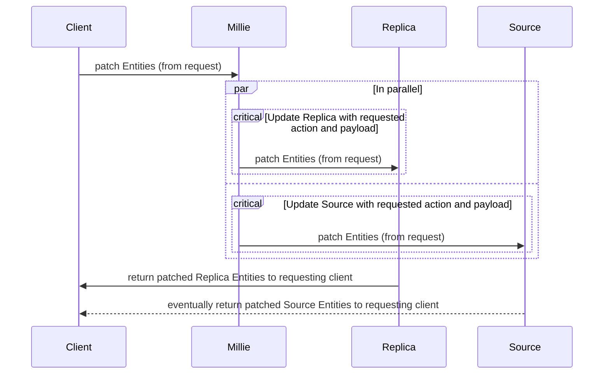

# Patch CRUD Action

MillieJS provides the an interface for Patch update actions that sync between a
replica store and the upstream source. The sync action in operation today is
rudimentary, however, with no real fault-tolerance, scalability, or
concurrency (see below).

## Current

## Future Plans

This first iteration of MillieJS only covers basic sync capabilities. This is
by all means a minimally-viable product ("MVP") with intentional limitations in
place, however, future scale is coming.

More information can be found at the following links:
- Support CRUD action concurrency (#19)
- CRUD action fault-tolerance (#27)
- Expand Query capabilities (#28)
- Investigate CRUD action improvements (#49)
